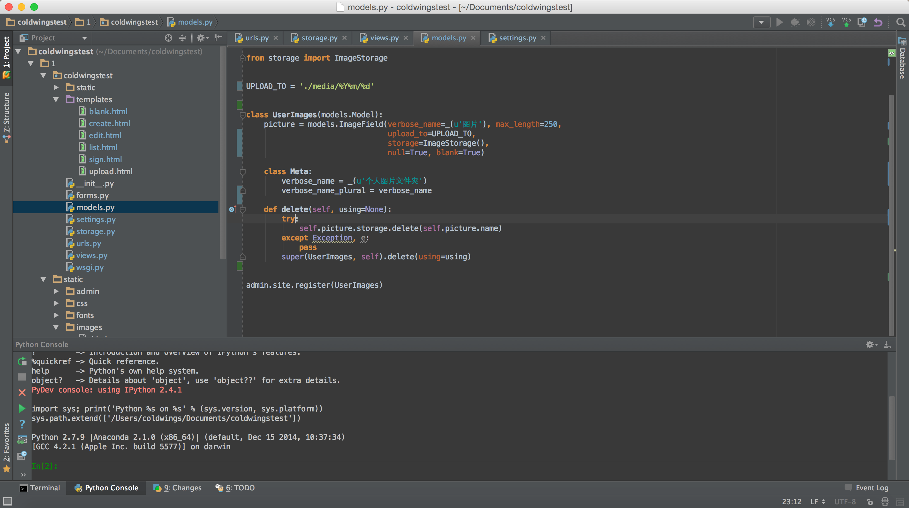
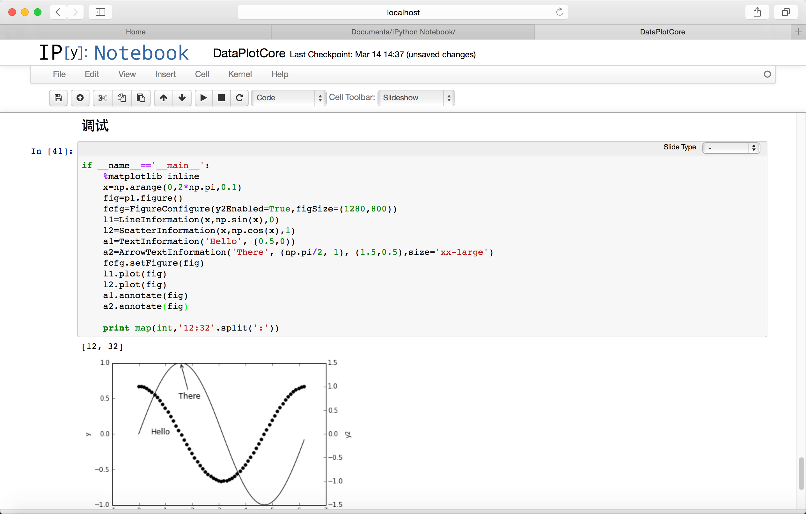
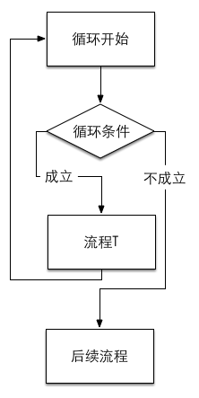

# Python非典型教程

| 作者    |        Coldwings | 
| :---- | ---------------: | 
| 开始日期  |       2015.03.11 | 
| 完成日期  |              鬼知道 | 
| Email | coldwings@me.com | 

# 目录

[TOC]

# 一、Duang的一下开始了！

## 1.1 为什么有这个教程？

其实一开始要写这个教程我是拒绝的，因为我不是什么高端选手，用Python用的也不是很全面（基本上就做做科学计算，Django写写网页后台微信公众号，偶尔PyQt做点东西玩玩），这样的人写教程是妥妥被喷的死去活来的。但是人家说可以写个最最简单的给新手入门的教程，人家一看，Duang的一下，笑着看完了能拿来写个两三行代码，也挺好啊。这么一说好有道理，我完全无力反驳呢……

仔细想想，Python这个东西关键字这么少，大多数功能其实都是五花八门的模块提供的，这样一来它其实真的很简单呢。

``` python
#!coding=utf8
import keyword
print(u'总共有%d个关键字'%len(keyword.kwlist))
print(keyword.kwlist)
```

``` 
总共有31个关键字
['and', 'as', 'assert', 'break', 'class', 'continue', 'def', 'del', 'elif', 'else', 'except', 'exec', 'finally', 'for', 'from', 'global', 'if', 'import', 'in', 'is', 'lambda', 'not', 'or', 'pass', 'print', 'raise', 'return', 'try', 'while', 'with', 'yield']
```

才31个关键字，确实跟特技一般呢！

## 1.2 这个教程到底会讲些什么?

首先说明：这不会是一个大而全的教程。如果你是一个完全的新手，看完教程不可能瞬间就能架出一个web app，也不会看完就能写个激光传输仿真，估计还不太可能上手pia敲出一个带图形界面的程序。这个教程只是个纯粹的Python入门教程，需要说明的只是这个语言的特性，至于上述说的那些工作，需要在看完本文之后再仔细学习各种模块，研究算法，理解要用的UI库的使用方法等等等等。

这位客官先别急着走啊！要知道这里讲究的是基础的基础，但凡没学过Python的看看都会多少有点用处的东西。我的目标是：学完这玩意，理解基础用法，然后你就可以去看各个模块的Wiki研究自己的程序应该怎样在Python上开始了。

## 1.3 所以这个教程就是用来入门的？

非常正确，就是个入门教程。当然你也可以把它当成段子手的小玩笑。

# 二、Python，出击！

## 2.1 Python界持续了不知道多少年的问题：选用哪个版本的Python？

先说本教程，现在用的是Python 2.7.9。其实这个问题真的不太重要，3.x的Python更加标准化，可以说更加优雅，而且通过强制utf8之类的手段在解释器层面上统一了字符编码问题，乃是拯救人生的神器。

### 2.1.1 为什么暂时不用3.x？

因为模块……这么多年了居然还有大量的模块没改过来支持3.x。2.7.x已经在很多方面靠近3.x了，大多数3.x的程序可以直接甩到2.7.x上跑，反过来倒是不一定……另外在网上能找到的大多数代码都还是2.x的，方便找资料偷懒嘛。

### 2.1.2 迁移到3.x麻烦么？

2.x是不断向3.x发展的，两者的差异已经越来越小。对于本教程里的内容而言，似乎最大的差异只在于print在2.x里是关键字，而在3.x中已经是一个函数了。所以说迁移只是分分钟的事，一旦你学会了Python，无论2.x还是3.x，相互变换都没啥问题。

## 2.2 然后我就去官网下载个Python开始玩？

完全可以。对于Linux/Mac用户而言更加简单，反正要什么包随时pip都行，没有什么困难的事情。对于Windows用户稍微麻烦一点，但也只是一点点而已。不过如果你跟我一样懒，那么向你推荐直接安装各种发行版，如：

|    名称     | Win  | Mac  | 网址                               | 
| :-------: | :--: | :--: | :------------------------------- | 
| Anaconda  | yes  | yes  | http://continuum.io              | 
|    EPD    | yes  | yes  | https://www.enthought.com        | 
| WinPython | yes  |  no  | http://winpython.sourceforge.net | 

当然其实还有很多选择。列出这几项只不过是因为我都用过而已。它们一般都带个还不错的包管理（尽管已经有了pip），有大量的预编译好的模块和软件可用，方便得无与伦比。

## 2.3 那开发环境呢？

学习的话，一般都自带一个IDLE，很简单但是也很有效。除此之外，新手还非常推荐Spyder，这是个长相巨丑但是能即时显示文档的IDE，不记得模块怎么用之类的问题，它能随时给与提示。当然，万众公认的神器PyCharm这种全功能IDE显然不能放过。

如果不太喜欢IDE，喜欢轻量级一点的东西，选择就更多了，比如两大党Vim和Emacs，又比如Sublime Text和Textmate，再比如让人说不出好坏的SciTE。其实选择怎样的编辑器一点都不重要，重要的是写代码不是么？

我常用的工具包括：

- PyCharm



完整的IDE，包含图形化的包管理、版本控制、多语言高亮等等功能，强大而丰富，用它配合Django做webapp特别愉快。

- Sublime Text


带有SVN、一大堆插件、界面友好、速度快的文本编辑器，最重要的是它自身就与Python紧密结合。

- IPython Notebook



科学计算神器，本身是个web-app，通过IPython加载本地服务器，通过浏览器访问。在用Python写程序的同时用Markdown写文章，程序写完了，文档也出来了，论文也差不多完成了。与matplotlib结合紧密，特别适合做科学计算。

# 三、那么……试试看？

## 3.1 第一个程序——咱能不玩"Hello, world!"么...

必须的可以。我们可以尝试输出任何的内容，例如：

``` python
print 'Yoooo!'
```

``` 
Yoooo!
```

嘛……是不是很简单？就是这样，Python作为一个解释型语言，完全可以没有所谓的文件头，没有所谓的入口函数，输出就是一句话而已。

### 3.1.1 这里的print是什么？

如果你还记得前面的关键字列表，print就是其中之一。至于它的作用，就是把字符串输出到屏幕上。

# 四、教练说，要系统化地学习……

## 4.1 Python的程序运行顺序是怎样的？

前面说到Python是没有入口函数的，也就是没有C/C++里的`main()`，在Python里是不存在这货的——Python的基本执行逻辑就是从代码的第一行到最后一行依次执行。

你所写的程序对解释器而言就是一个简单的说明书，而解释器则是一个听话的小娃娃，会认真的一行行读说明，再严格遵照你的指示一步步完成你安排给它的事情。所以当程序出现问题的时候，记得不要生气，不要打孩子，仔细看看自己给的说明书是不是写错了才是重点——毕竟，小孩子其实一般都比较笨的说。

## 4.2 另外，缩进很重要！

这里是全文第一处提到缩进的地方，以后或许不会重复太多次，但是请一定记住：对于Python而言，缩进很重要。基本上随便一个支持Python的编辑器/IDE都会有很完善的自动缩进功能，但不同于其它语言，Python没有诸如花括号或者begin-end之类的花样，缩进是唯一区分程序段的依据，因此要严格遵守以下缩进规则。

1. **程序使用统一的缩进符号，不要混用空格和`tab`符号；**
2. **程序统一使用相同的缩进空格数，不要第一层缩进3个空格第二层4个；**
3. **不要给最外层的代码添加缩进。**

看在这段话写得这么严肃的份上……请一定记住。

# 五、先不管那些，我总得能有输入输出对吧？你说对吧？

## 5.1 先说输出，因为很重要，所以再说一次。

前面已经提到了输出语句`print`，接下来进行稍微详细一点点的说明。

它的作用——把**字符串**输出到屏幕上。

在Python 3.x中，`print`已经不再是关键字而是一个函数，提供了更丰富的参数，用起来更清晰。但是由于机制不同，如果需要将代码迁移到3.x，需要作一些修改。

因为很重要，所以要说三次:

***它的作用——把字符串输出到屏幕上。***

### 5.1.1 咦？只是字符串？

是的，确实只是字符串。当我们需要输出的类型并不是字符串时，它会自动转换成字符串，比如

``` python
answer=42
print answer
```

``` 
42
```

### 5.1.2 不对啊，不是说只能是字符串么？怎么数字也行呢？

这就涉及到Python的第一个特性——完全对象化。在Python中，**生命、宇宙和一切都是对象实例**，数字也不例外。当使用`print`输出它们的时候，会先用str函数将其转换成字符串，而实际上会调用这个对象的一个成员函数`__str__()`，它将返回一个字符串。也就是说上述程序的实质是

``` python
answer=42
print str(answer)
```

``` 
42
```

### 5.1.3 好像每个print语句输出完都自动换行，不想换行怎么办？

这位同学你观察得好仔细！对于每个`print`语句，默认情况下会在末尾自动加上一个换行符。所以这样的程序

``` python
print 'love'
print 'you'
```

它的输出结果将会是

``` 
love
you
```

对于Python 2.x，要让它不换行，解决方案是在`print`语句后加个逗号，例如

``` python
print 'love',
print 'you'
```

``` 
love you
```

不爽的是，输出内容会用一个空格分开。

在Python 3.x中这个办法行不通，因为`print`已经成为了个函数，加逗号反正是不行的了。正确的姿势应当是指定`print()`的参数，包含多参量分隔符`sep`和输出末尾添加内容`end`。上述就应该写成`print('love', end=' ')`以实现不换行。这毫无疑问是个很优秀的改进，但在此处不多做讨论，我们还是以2.7版本为主。

### 5.1.4 我学过c/c++/java，它们都有格式化输出，在Python里怎么办？

没有相关语言基础的人可能会看不懂下面这一段内容，但是请完全不要在意。这一点都不会影响你的学习进程。

在Python并不存在“格式化输出”，但是格式化字符串是确实存在的——任意字符串对象都有一个`%`运算符，它的作用就是将原串中的格式化文本变量带入，如：

``` python
everything='everythin'
answer=42
explain='The answer to life, the universe, and %s, is %d'%(everything, answer)
print explain
print 'The answer to life, the universe, and %s, is %d'%(everything, answer)
```

``` 
The answer to life, the universe, and everythin, is 42
The answer to life, the universe, and everythin, is 42
```

当然，Python还有更加Pythonic的格式化输出方式。之前提到Python中的输出都是对`__str__()`方法调用后得到的字符串的输出，因此可以理解为Python里面本不存在过多的变量类型。所以更具有Python风格的字符串格式处理是如下`format()`方法。

``` python
print 'Coordinates: {latitude}, {longitude}'.format(latitude='37.24N', longitude='-115.81W')
c = 3-5j
print ('The complex number {0} is formed from the real part {0.real} and the imaginary part {0.imag}.').format(c)
```

``` 
Coordinates: 37.24N, -115.81W
The complex number (3-5j) is formed from the real part 3.0 and the imaginary part -5.0.
```

可以看到这里并没有指定类型，但是都能够正常输出。对于熟悉C/C++的人而言，完全对象化将是需要一定时间适应才能跨过去的坎儿。

## 5.2 然后是输入了吧？

输入有两个相关的基本函数。需要说明的是，输入**不是语句**，这一点与print不同。输入都是函数。关于函数的概念会在后文中说明，如果现在不明白也不要在意，记住怎么用就好。

### 5.2.1 关于输入的一致性——还是字符串

基本输入函数是`raw_input([prompt])`，这里方括号括起来的`[prompt]`是按照Python文档的风格，表示非必须参数。也就是说可以直接写`raw_input()`，也可以写成`raw_input('Ahh')`。

它的作用是：读取用户输入的一行字符串。

基本作用类似于C语言里的`gets()`。反正就是执行这个函数时，程序会停下来，等用户输入点什么东西，输入完了按`Enter`回车键之后，程序会继续，并且把输入的这行内容以字符串的形式作为`raw_input()`的结果返回过来。

### 5.2.2 如果我输入的是数字什么的，它怎么处理？

考虑下面这段程序：

``` python
x=raw_input()
print x
print type(x)
```

这其中`type(x)`的作用是输出x变量的类型。我们运行它，输入：

``` 
1314
```

可以看到如下结果

``` 
1314
<type 'str'>
```

看到了么？还是`str`类型，还是字符串。

结论是：**不处理**

让我们看看raw这个英文单词的翻译：

> - raw
>   
>   n. 痛处；生的食物；纯酒；粗糖
>   
>   adj. 生的；未烹制的；未煮的；未经加工的
>   
>   v. 使皮开肉绽
>   
>   网络 未加工的；原始；未煮过的
>   
>   它的结果就是原始输入数据。原始输入数据自然是键盘敲进去的字符串啦~

### 5.2.3 可是我就是要数字~数字嘛~~

这就涉及到另一个输入函数了：`input([prompt])`。

它的作用是：将用户输入的内容当做是一个Python表达式交给解释器算一下，然后把结果作为返回值输出。动态语言的好处之一就体现出来了，不用编译，想算什么算什么，就是这么任性。

看看下面这个例子：

``` python
x=input()
print x
print type(x)
```

输入：

``` 
1314
```

输出：

``` 
1314
<type 'int'>
```

既然经过了解释器，输入的内容如果是个数字自然就解释成数字了。当然如果你想输入个`3*4`之类的，它会把计算结果存下来。

输入：

``` 
3*4
```

输出：

``` 
12
<type 'int'>
```

但是当你输入个字符串的时候，问题就出现了：对于解释器而言，字符串必须是用`' '`或者`" "`括起来的部分。而习惯上输入字符串是直接输入的，这样就会出错。

输入：

``` 
love
```

输出：

``` 
Traceback (most recent call last):
  File "/Users/coldwings/Documents/Study/test.py", line 2, in <module>
    x=input()
  File "<string>", line 1, in <module>
NameError: name 'love' is not defined
```

正确的姿势应该是这样:

输入：

``` 
'love'
```

输出：

``` 
love
<type 'str'>
```

### 5.2.4 好吧，说了这么多，那个prompt到底是什么？

简单的说，就是给用户看的输入提示。毕竟什么都不输出的话就让别人输入内容，用户会满头雾水的。

其实以下两段程序可以认为是等价的。

第一段：

``` python
print 'input something:',
a=raw_input()
```

第二段：

``` python
a=raw_input('input something: ')
```

注意由于`print`语句在加了个逗号的情况下，会多输出个空格代替换行，因此上面程序中如果要取得完全相同的视觉效果，就需要在`prompt`串的末尾加入一个空格。

# 六、“变量”与“赋值”

这个两个概念充满了各种编程语言，这里沿用了这个称呼。但是这是Python，就算你有其它语言的经验，也请暂时放到一边。因为在Python中，实际上是**不存在真正意义上的变量与赋值**的。

## 6.1 变量——谁是啥

顾名思义，变量就是可以变动的量，我们可以随时改变它的值。通常变量是有类型的，字符有字符变量，整数是整数变量，浮点数有浮点变量（其实浮点数就是数学上所说的有理数：可能有小数点后面的部分）。

就像我们在做数学证明题中的用法一样：

``` 
令a为42
```

``` python
a=42
```

这就成为了一个声明：a是一个量，它代表着42。与数学不同的是，a在Python里还是个可以变化的量。随着程序的执行，我们可能会改变a的取值。在数学证明题里你一会儿令a为42一会儿令a为7有可能会被数学老师吊着打，但是在这里是没问题的：

``` python
a=42
print a
a=7
print a
```

``` 
42
7
```

第一次输出a时，它是42；第二次输出a时，它是7。这就是“变”字所在。所谓变量，就是我们创造出来的一个名字而已，我们说它是啥，它就是啥。

## 6.2 赋值——我要让谁是啥谁就是啥

### 6.2.1 对于初学者

在之前的章节中，我们可以看到很多`=`，这里的`=`并不是数学方程里的“等于”关系。相等是一个等号两边完全对等的关系说明，而在Python中单个的`=`是赋值运算。它的`=`两边并不是对等的。`=`左边必须是一个变量名（或者是**元组**之类的玩意），右边则可以是任何对象（还记得Python的完全对象化么？数什么的也都是对象），而作用就是：

**让左边的变量名指向右边的对象**

当然，如果右边是一个计算式，或者一个函数什么的，程序会先把右边的结果算出来，再把左边的名字指向计算结果。这个过程就称作赋值。

### 6.2.2 对于有编程基础的读者

在Python里其实是不存在变量的。之前说过Python里所有的东西都是对象，而类似“变量”的东西其实都只不过是一张标签。对于这样一段程序：

``` python
a=42
print a
a=7
print a
```

程序解释的实际流程其实是：创建了一个值为42的整数对象，然后给它贴上a的标签，输出，然后再创建一个值为7的对象，把a这个标签换到它身上，然后输出。赋值的意义就是这个贴标签的过程。

这就是为什么python里一个变量名可以一会儿为整数一会儿为实数，过一会儿还能改成字符串或者其它的什么东西。Python的变量没有指明类型的根本原因就是因为它只是指向对象的标签，Python本身其实是一个强类型语言。新手面临的很多“变量的值莫名其妙变了”或者“变量的值莫名其妙不变”之类的问题根源大都在于这个机制，因此理解这一点可以减少很多程序上的bug。

# 七、开始基本流程

大家都知道，程序嘛，就是一条一条执行的玩意。当然还有个流程控制问题，而最基本的流程控制，就是判断和循环。

## 7.1 先是判断——以追妹子为例

判断的基本形式可以看成如下流程：


来个形象一点的比喻，就是：

你去酒吧，这时候视野里出现了一只妹纸，你可以选择是不是给她送上一杯酒然后套套近乎什么的，但这些有一个基本判断标准：这个妹子看上去挺喜欢，那就去套近乎；完全没感觉，那就选择不看她。用Python的语言来说就是这样的。

``` python
妹子.coming()
if 我.like(妹子):
    送酒
    套近乎
else:
    无视
```

当然这里是以男性角度举例的。如果你是一朵妹纸，或者其它情况，可以做出类似的比喻。无论怎样，这个过程就是我们做决策的流程，也是程序中判断流程的基本实现。

有人说“你这个例子不够全面。送酒了就能套近乎？万一妹子拒绝了那不就只能放弃了么！还有啊第一眼看到妹子没感觉不能直接无视啊，如果妹子行为举止很带感呢？不观察一下怎么行！”

好吧我表示没怎么去过酒吧所以不懂，按照这个原则的话可以拓展一下。

``` python
妹子.coming()
if 我.like(妹子):
    送酒
    if 妹子.accepted():
        套近乎
    else:
        无视
elif 我.feel(妹子) is 带感:
    送酒
    if 妹子.accepted():
        套近乎
    else:
        无视
else:
    无视
```

`elif`可以判断出来这是`else if`的缩写，但是如果按照Python规则，应该写成`else: if`，而这样看起来很奇怪，还容易引起**缩进问题**，所以广大人民群众就乐于用缩写了。

嘛，这个例子说明，在酒吧跟陌生妹子套近乎显然是个很复杂的事情——比写程序复杂。至少对于一段Python程序而言，判断只用这么几样东西就可以了，`if`，`elif`，`else`，在英文中的意思分别是“如果”，“否则如果”，“否则”。所以简单翻译一下，这两段程序和之前那么一长串中文介绍其实是等价的。

## 7.2 然后是循环——还是那个妹子

循环嘛，故名思议，不断重复的流程。基本上是这么个过程



如果大家还是喜欢比喻，那么我们来考虑一下如下情况：

上次酒吧约的妹子成功了一半，但是妹子有个要求：必须在现在每天都去她工作的地方接她下班，坚持一个月（假设是2015年4月）。那么我应该怎么做呢？

``` python
for day in 日期(2015年4月):
    我.pickup(妹子)
后来
```

于是对于2015年4月的每一天，“我”都会pickup妹子一次。好像很不错的样子。

但是万一妹子没有指定时间呢？只是要求每天都去接她，直到她满意为止……

``` python
while not 妹子.satisfied():
    我.pickup(妹子)
后来
```

再多想想：如果妹子中途说不行不行不想理你了不要再见到你了……先不考虑违背妹子意见的情况，为了节约体力……

指定时间

``` python
for day in 日期(2015年4月):
    我.pickup(妹子)
    if 妹子.refused():
        break
后来
```

直到满意

``` python
while not 妹子.satisfied():
    我.pickup(妹子)
    if 妹子.refused():
        break
后来
```

break的作用是跳出当前循环。

于是妹子一旦拒绝，基本就没戏了，那就不要再接了（我知道有时候妹子说不要接了但是一定要坚持我真的知道！）……

假定妹子中途拒绝了那就没有后来了，可是如果顺利结束了（时间到/妹子满意）了，好感度增加，可以更进一步哦……那么基本上是这样的：

指定时间

``` python
for day in 日期(2015年4月):
    我.pickup(妹子)
    if 妹子.refused():
        break
else:
    好感度+=1
后来
```

直到满意

``` python
while not 妹子.satisfied():
    我.pickup(妹子)
    if 妹子.refused():
        break
else:
    好感度+=1
后来
```

对于循环中的else分支，应该属于python循环中比较独特的一个用法。当循环正常退出而不是中途break的情况发生时，则执行else里面的内容；相反若是break跳出，则会跳过else分支。

唔……结论还是：追妹子比写程序麻烦多了，注定孤独一生啊……

## 7.3 又是那个非常重要的点：缩进

追妹子是有讲究的，写程序也有自己的讲究。在Python里最重要的讲究之一就是缩进了。对于学习过其它语言的同学来说，一句话说明就可以了：Python里面没有begin-end或者花括号之类的代码块划分，划分的标准就是缩进。两行程序缩进不同，就判断为不同的缩进块，因此严格按照缩进写程序是保证程序正确执行的**必须的**要求。这个做法好不好，仁者见仁智者见智，但至少这样的做法强制写程序的人使用严格的缩进，增强了代码的可读性。

对于没有编程基础的同学而言，缩进并不神秘。

上述程序中，某些语句的最前面会出现很多空格。空格的意义就是缩进。在Python里，缩进用来告诉解释器，这行语句是属于循环中的还是属于循环外，是条件判断内还是条件判断外或者判断本身。一下两段（伪）程序：

``` python
while not 妹子.satisfied():
    我.pickup(妹子)
    if 妹子.refused():
        break
else:
    好感度+=1
后来
```

与

``` python
while not 妹子.satisfied():
    我.pickup(妹子)
    if 妹子.refused():
        break
    else:
        好感度+=1
后来
```

看起来只有一点点不同：

``` python
else:
    好感度+=1
```

只有缩进不一样，但是实际意义是有很大不同的。

对于前者，else与while对齐，说明这个else是while循环的else，只有当循环结束且没有break中途跳出时才会执行的语句。而后者，else与if对齐，是条件判断的else分支，只要妹子没拒绝，好感度就会增加。

这么一看，其实第二段程序更加贴近实际……吧……？也许追妹子之前还是先调整好缩进比较重要……

## 7.4 一点点附加说明

到现在为止，我们可以做一些非常非常简单的东西了：有输入，有输出，有赋值，有判断。这样做个小菜单什么的都没有太大问题。大多数的程序其实就是由这么一些简单的东西组成的。对于简单脚本，这些已经能做好大多数的工作了。

后续章节会逐步介绍Python中的各种常见类型和运算，以及一些模块化和对象化编程的知识，为的是更好地写出有用的程序。